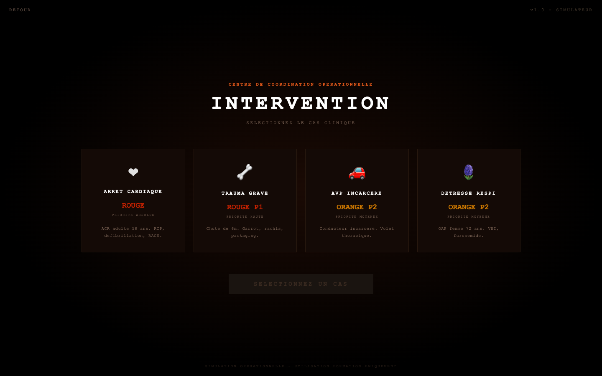

# SDMIS — Ambulance Call Simulator

3D simulator of emergency medical calls, built to practice the first-aid protocols taught in French firefighter training.

**[Launch the simulator →](https://sacha9214.github.io/sdmis-sim/)**



## Clinical cases

| Case | Priority | Scenario |
|---|---|---|
| Cardiac arrest | Red | 58-year-old adult in cardiac arrest: CPR, defibrillation, return of spontaneous circulation |
| Major trauma | Red P1 | 6 m fall: tourniquet, spinal immobilization, packaging |
| Road traffic collision | Orange P2 | Trapped driver, flail chest |
| Respiratory distress | Orange P2 | Acute pulmonary edema in a 72-year-old woman: non-invasive ventilation, furosemide |

## Features

- **3D scene**: ambulance with flashing lights, animated rescuers and patient, clinical signs visible on the skin (cyanosis, pallor, mottling, sweating)
- **MARCH assessment**: massive hemorrhage, airway, respiration, circulation, hypothermia
- **Live vital signs**: heart rate, SpO2, blood pressure, respiratory rate, blood glucose, temperature, with alert thresholds
- **6-phase scenario** per call, with an event log
- **Adjustable speed** (×0.5, ×1, ×2) and touch controls (one-finger orbit, two-finger zoom)

The interface is in French.

## Stack

A single `index.html` file: HTML, CSS and JavaScript, with 3D rendering by [Three.js](https://threejs.org/) r134. No build step, nothing to install.

## Run locally

```bash
python3 -m http.server 8000
# then open http://localhost:8000
```

## Disclaimer

Personal study project, not affiliated with the SDMIS (Rhône fire and rescue service). It does not replace official training or protocols.

## License

[MIT](LICENSE)
